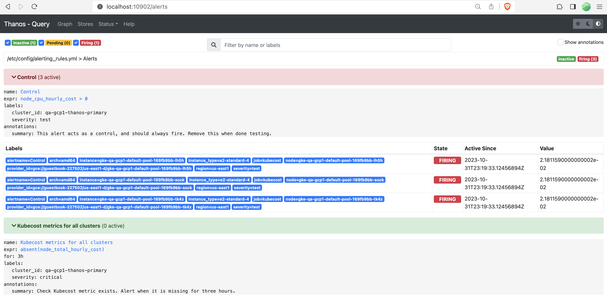

# Monitoring Kubecost with Prometheus/Thanos AlertManager



## Usage

To begin testing the alerting rules, add the configurations shown in this directory's `values.yaml`.

In FedETL environments, ensure that these configs are applied to every cluster that Kubecost is monitoring. In Thanos environments, these configs only need to be applied on your primary cluster.

```bash
helm upgrade -i kubecost cost-analyzer \
  --repo https://kubecost.github.io/cost-analyzer/ 
  -f values.yaml
```

To receive notifications when the alerting rules fire, you need to setup Prometheus AlertManager. You can do so by creating the following configmap, ensuring that `.Values.prometheus.alertmanager.enabled=true`, and then restarting the prometheus-server or thanos-query pod.

```bash
kubectl create configmap kubecost-prometheus-alertmanager --from-file alertmanager.yaml
```

## Testing

If you'd like to quickly test the alerting rule without performing a `helm upgrade`, you can do the following:

1. `kubectl edit configmap/kubecost-prometheus-server`
2. Add your alerting rules under the `alerting_rules.yml` section of the configmap
3. Restart the prometheus-server or the thanos-query pod
