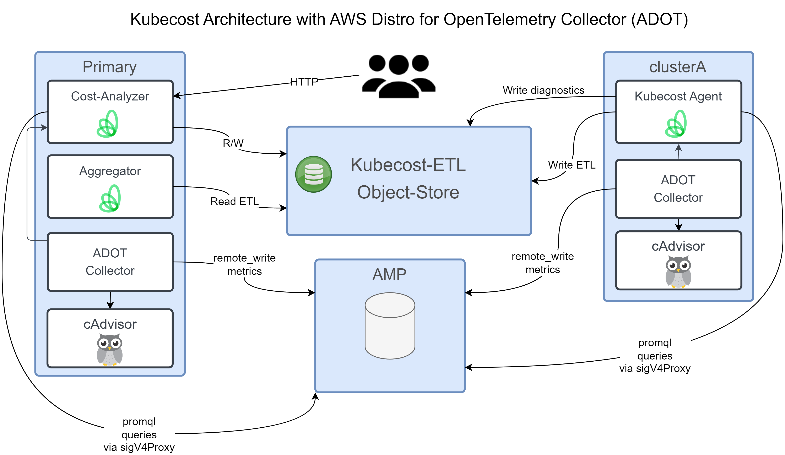

# Kubecost with AWS Distro for Open Telemetry

## Overview

This guide will walk you through the steps to deploy Kubecost with AWS Distro for Open Telemetry (ADOT) to collect metrics from your Kubernetes cluster.

## Prerequisites

Follow AWS guide to install the ADOT daemonset: <https://docs.aws.amazon.com/prometheus/latest/userguide/AMP-onboard-ingest-metrics-OpenTelemetry.html>

Update all configuration files in this folder that contain `YOUR_*` with your values.

This guide assumes that the Kubecost helm release name and the Kubecost namespace are equal, which allows a global find and replace on `YOUR_NAMESPACE`.

## Architecture Diagram



## Configuration

1. Update all configuration files with your cluster name (replace all `YOUR_CLUSTER_NAME_HERE`). The examples use the key of `cluster` for the cluster name. You can use any key you want, but you will need to update the configmap and deployment files to match. A simplified version of the ADOT DS installation is below.

### ADOT Configuration

Deploy the ADOT Daemonset, there are many options for this. At a minimum, Kubecost needs the provided scrape config to be added to the ADOT Prometheus configmap.

1. Add the Kubecost scrape config to the ADOT Prometheus configmap:

    Note that this sample configmap also contains cadvisor metrics, which is required by Kubecost.

    ```bash
    kubectl apply -f example-configs/prometheus-daemonset.yaml
    ```

Alternatively, you can add these items to your [existing configmap](example-configs/kubecost-adot-scrape-config.yaml)

### Kubecost Primary Installation

1. Create the Kubecost namespace:

    ```bash
    kubectl create ns YOUR_NAMESPACE
    ```

1. Create the AWS IAM policy to allow Kubecost to query metrics from AMP:

    ```bash
    aws iam create-policy --policy-name kubecost-read-amp-metrics --policy-document file://iam-read-amp-metrics.json
    ```

1. Create the AWS IAM policy to allow Kubecost to write to the `federated-store` S3 bucket:

    ```bash
    aws iam create-policy --policy-name kubecost-bucket-policy --policy-document file://iam-kubecost-metrics-s3-policy.json
    ```

1. (Optional) Create the AWS IAM policy to allow Kubecost to find savings in the AWS Account:

    ```bash
    aws iam create-policy --policy-name DescribeResources --policy-document file://iam-describeCloudResources.json
    ```

1. (Optional) Create the AWS IAM policy to allow Kubecost to write to find account-level tags:

    ```bash
    aws iam create-policy --policy-name OrganizationListAccountTags --policy-document file://iam-listAccounts-tags.json
    ```

1. Configure the Kubecost Service Account:

    * If the following fails, be sure that IRSA is enabled on your EKS cluster. <https://docs.aws.amazon.com/eks/latest/userguide/iam-roles-for-service-accounts.html>

    ```bash
    eksctl create iamserviceaccount \
    --name kubecost-sa \
    --namespace YOUR_NAMESPACE \
    --cluster YOUR_CLUSTER_NAME_HERE --region YOUR_REGION \
    --attach-policy-arn arn:aws:iam::AWS_ACCOUNT_ID:policy/kubecost-read-amp-metrics \
    --attach-policy-arn arn:aws:iam::AWS_ACCOUNT_ID:policy/kubecost-bucket-policy \
    --attach-policy-arn arn:aws:iam::AWS_ACCOUNT_ID:policy/OrganizationListAccountTags \
    --attach-policy-arn arn:aws:iam::AWS_ACCOUNT_ID:policy/DescribeResources \
    --override-existing-serviceaccounts --approve --profile admin
    ```

1. Create the Kubecost federated s3 object store secret.

    * There are many ways to create the secret, the below method may work best for automated tools.

    Copy the output from:

    ```bash
    base64 federated-store.yaml|tr -d '\n'
    ```

    And replace the place holder in `values-kubecost-s3-federated-store.yaml`

1. Update the place holder values such as YOUR_CLUSTER_NAME_HERE in [values-kubecost-primary.yaml](values-kubecost-primary.yaml)

1. Install Kubecost Primary:

    ```bash
    helm install YOUR_NAMESPACE -n YOUR_NAMESPACE \
        kubecost/cost-analyzer \
        -f values-kubecost-primary.yaml \
        -f values-kubecost-s3-federated-store.yaml
    ```

### Kubecost Agents Installation

This assumes you have created the AWS IAM policies above. If using multiple AWS accounts, you will need to create the policies in each account.

1. Update the place holder values such as YOUR_CLUSTER_NAME_HERE in [values-kubecost-agent.yaml](values-kubecost-agent.yaml)

1. Create the Kubecost namespace:

    ```bash
    kubectl create ns YOUR_NAMESPACE
    ```

1. Configure the Kubecost Service Account:

    ```bash
    eksctl create iamserviceaccount \
        --name kubecost-sa \
        --namespace YOUR_NAMESPACE \
        --cluster YOUR_CLUSTER_NAME_HERE --region YOUR_REGION \
        --attach-policy-arn arn:aws:iam::AWS_ACCOUNT_ID:policy/kubecost-read-amp-metrics \
        --attach-policy-arn arn:aws:iam::AWS_ACCOUNT_ID:policy/kubecost-bucket-policy \
        --attach-policy-arn arn:aws:iam::AWS_ACCOUNT_ID:policy/OrganizationListAccountTags \
        --attach-policy-arn arn:aws:iam::AWS_ACCOUNT_ID:policy/DescribeResources \
        --override-existing-serviceaccounts --approve --profile admin
    ```

1. Deploy the Kubecost agent:

    ```bash
    helm install YOUR_NAMESPACE \
        kubecost/cost-analyzer \
        -f values-kubecost-agent.yaml \
        -f values-kubecost-s3-federated-store.yaml
    ```

## ADOT Daemonset Easy Install

[All in one ADOT DS config](example-configs/prometheus-daemonset.yaml)

## Troubleshooting

It will take a few minutes to the environment to normalize.

The `RunDiagnostic` logs in the cost-model container will contain the most useful information.

```sh
kubectl logs -n kubecost deployments/kubecost-cost-analyzer cost-model |grep RunDiagnostic
```

Test to see if the Kubecost metrics are available using Grafana or exec into the Kubecost frontend to run a curl against the AMP endpoint:

Grafana Query: `count({__name__=~".+"}) by (job)`

Port-forward to cost-model:9090: `kubectl port-forward -n kubecost svc/kubecost-cost-analyzer 9090:9090`

Direct link[localhost:9090](http://localhost:9090/grafana/explore?schemaVersion=1&panes=%7B%22muO%22%3A%7B%22datasource%22%3A%22PBFA97CFB590B2093%22%2C%22queries%22%3A%5B%7B%22refId%22%3A%22A%22%2C%22expr%22%3A%22count%28%7B__name__%3D%7E%5C%22.%2B%5C%22%7D%29+by+%28job%29%22%2C%22range%22%3Atrue%2C%22instant%22%3Atrue%2C%22datasource%22%3A%7B%22type%22%3A%22prometheus%22%2C%22uid%22%3A%22PBFA97CFB590B2093%22%7D%2C%22editorMode%22%3A%22code%22%2C%22legendFormat%22%3A%22__auto%22%7D%5D%2C%22range%22%3A%7B%22from%22%3A%22now-1h%22%2C%22to%22%3A%22now%22%7D%7D%7D&orgId=1)

Or exec command:

```sh
kubectl exec -i -t \
  deployments/kubecost-cost-analyzer \
  -c cost-analyzer-frontend -- \
  curl -G "0:9090/model/prometheusQuery" \
  --data-urlencode "query=node_total_hourly_cost"
```

Failure:

```json
{"status":"success","data":{"resultType":"vector","result":[]}}
```

Success:

```json
{
  "status": "success",
  "data": {
    "resultType": "vector",
    "result": [
      {
        "metric": {
          "__name__": "node_total_hourly_cost",
          "arch": "amd64",
          "cluster_id": "eks-integration",
          "instance": "ip-172-31-9-41.us-east-2.compute.internal",
          "instance_type": "m6a.xlarge",
          "job": "kubecost-metrics",
          "node": "ip-172-31-9-41.us-east-2.compute.internal",
          "provider_id": "aws:///us-east-2a/i-0d844bf800d01bde1",
          "region": "us-east-2"
        },
        "value": [
          1709403009,
          "0.1728077431907654"
        ]
      }
    ]
  }
}
```
