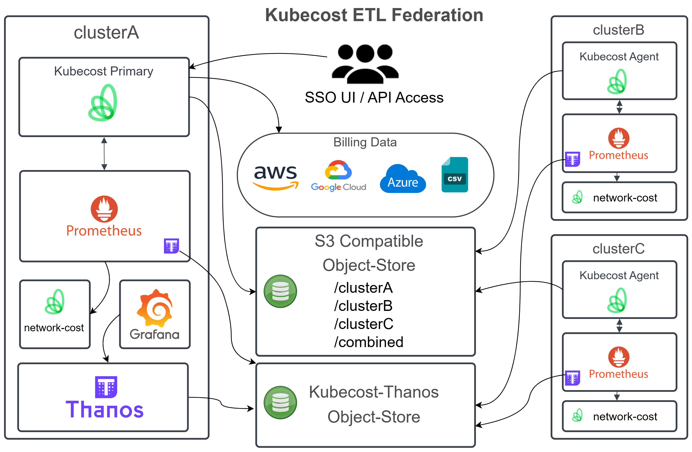

# Thanos for Prometheus Metric Shipping only

This method will allow Prometheus to ship metrics to a shared object store without interfering with ETL Federation. There are two primary benefits to this:

- Ability to rebuild from the metrics
- Visibility into source metrics with tools like Grafana

See official docs: <https://docs.kubecost.com/install-and-configure/install/multi-cluster/federated-etl/federated-etl-backups-alerting#option-2-metrics-backup>

## Prometheus Configuration

Configure an object store for the Thanos Metrics:

See [this guide](https://docs.kubecost.com/install-and-configure/install/multi-cluster/thanos-setup/long-term-storage#step-1-create-object-store.yaml) for more information.

The Thanos bucket can be the same as the etl-federation bucket, but for purposes of granular retention policies, this example assumes a new bucket will be created.

Sample yaml configurations for various providers (any S3 compatible store will work):
- [AWS S3](../../aws/object-store.yaml)
- [Azure Storage](../../azure/object-store.yaml)
- [GCP Storage](../../gcp/object-store.yaml)
- [Storj](https://docs.kubecost.com/install-and-configure/install/etl-backup#storj)

> Note that Kubecost supports service account to IAM role mappings, secret keys are not required (though the k8s object is still a secret).


## Agent (secondary) Clusters
Create the secret for the Thanos object-store:

```sh
kubectl create secret generic kubecost-thanos -n kubecost --from-file=./object-store.yaml
```

Follow the steps in [etl-federation repo](https://github.com/kubecost/poc-common-configurations/tree/main/etl-federation) to configure an object-store for Kubecost ETL-Federation.

Configure [agent-federated.yaml](../agent-federated.yaml) with your cluster specific settings

Then add the [values-prometheus-thanos-sidecar.yaml](values-prometheus-thanos-sidecar.yaml) to the end of your helm install:

```sh
helm install kubecost \
  --repo https://kubecost.github.io/cost-analyzer/ cost-analyzer \
  --namespace kubecost --create-namespace \
  -f agent-federated.yaml \
  -f values-prometheus-thanos-sidecar.yaml
```

## Primary Cluster Only

Thanos is not used directly by Kubecost. This is simply for Grafana dashboards.

Create namespace and secret for thanos, use same bucket as above:

```sh
kubectl create secret generic kubecost-thanos \
  --from-file objstore.yml=./object-store.yaml \
  -n kubecost-thanos
```

Install thanos:

```sh
helm install kubecost-thanos \
  --repo https://charts.bitnami.com/bitnami thanos \
  --namespace kubecost-thanos  \
  -f values-thanos-store-primary.yaml
```

Add the Thanos query-frontend to Kubecost bundled Grafana:

```sh
helm install kubecost \
  --repo https://kubecost.github.io/cost-analyzer/ cost-analyzer \
  --namespace kubecost --create-namespace \
  -f primary-federator.yaml \
  -f values-prometheus-thanos-sidecar.yaml \
  -f grafana-datasource.yaml
```

## Diagram

