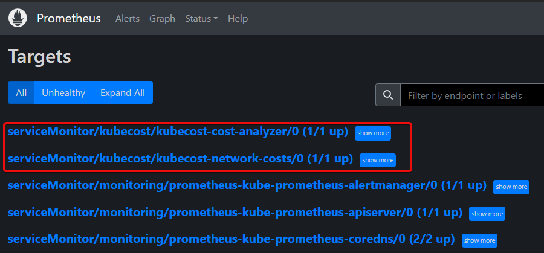

# Overview

These are the steps to enable ETL federation with Kubecost.

Federated-ETL is an efficient method to implement multi-cluster Kubecost while using existing Prometheus installations for short-term metrics.

When using an existing prometheus instance, Kubecost only requires a single pod per cluster. The example here also enables the networkCosts Daemonset which is optional.

[Contact us](https://www.kubecost.com/contact) for help customizing settings.

## Setup

### Prometheus Install (if not present)

```
helm upgrade prometheus \
  --repo https://prometheus-community.github.io/helm-charts kube-prometheus-stack \
  -n monitoring --create-namespace --install \
  --set nodeExporter.enabled=false \
  --set grafana.enabled=false
```

Prometheus may have a serviceMonitor selector that must be passed to the Kubecost serviceMonitor. You can find this with the below command:

```sh
kubectl get prometheuses.monitoring.coreos.com \
  -n monitoring prometheus-kube-prometheus-prometheus -oyaml \
 | grep serviceMonitor -A2
```

Default output:

```yaml
  serviceMonitorNamespaceSelector: {}
  serviceMonitorSelector:
    matchLabels:
      release: prometheus
```

Update the serviceMonitor config in the helm values with your label.

### Object-Store and Permissions Setup

Create and attach policy to kubecost IAM role (or create service account below):

```
aws iam create-policy \
 --policy-name kubecost-s3-federated-policy \
 --policy-document file://policy-kubecost-aws-s3.json
```

Create object-store for kubecost federation:

```
kubectl create namespace kubecost
kubectl create secret generic \
  kubecost-object-store -n kubecost \
  --from-file federated-store.yaml
```

If creating a new service account:

```
eksctl utils associate-iam-oidc-provider \
    --cluster your-cluster-name \
    --region us-east-2 \
    --approve
eksctl create iamserviceaccount \
    --name kubecost-irsa-s3 \
    --namespace kubecost \
    --cluster your-cluster-name \
    --region us-east-2 \
    --attach-policy-arn arn:aws:iam::111222333:policy/kubecost-s3-federated-policy \
    --approve
```

### Install Kubecost Primary Instance:

Be sure to either set the `CLUSTER_NAME` here or in both locations of the [primary-federator.yaml](./primary-federator.yaml).

> Note: in the below install command, because the CLUSTER_NAME arguments come after the filename, the arguments will win.

```
CLUSTER_NAME=cluster1
helm install kubecost \
  --repo https://kubecost.github.io/cost-analyzer/ cost-analyzer \
  --namespace kubecost \
  -f primary-federator.yaml \
  --set prometheus.server.global.external_labels.cluster_id=$CLUSTER_NAME \
  --set kubecostProductConfigs.clusterName=$CLUSTER_NAME
  --set federatedETL.federator.primaryClusterID=$CLUSTER_NAME
```


### Install Agents on all other clusters

Repeat the `Object-Store and Permissions Setup` above for all clusters, using the same S3 bucket.

Be sure to either set the `CLUSTER_NAME` here or in both locations of the [agent-federated.yaml](agent-federated.yaml).

> Note: in the below install command, because the CLUSTER_NAME arguments come after the filename, the arguments will win.

```
CLUSTER_NAME=cluster2
helm install kubecost \
  --repo https://kubecost.github.io/cost-analyzer/ cost-analyzer \
  --namespace kubecost --create-namespace \
  -f agent-federated.yaml \
  --set prometheus.server.global.external_labels.cluster_id=$CLUSTER_NAME \
  --set kubecostProductConfigs.clusterName=$CLUSTER_NAME
```

## Validation

View the kubecost UI and verify that idle costs are not negative.

```sh
kubectl port-forward services/kubecost-cost-analyzer 9090:9090 -n kubecost
```

In another terminal tab run:

```sh
curl 'localhost:9090/model/prometheusQuery?query=node_total_hourly_cost'
```

Good output (value here is `0.7645614692077637`):

```json
{
  "status": "success",
  "data": {
    "resultType": "vector",
    "result": [
      {
        "metric": {
          "__name__": "node_total_hourly_cost",
          "container": "cost-model",
          "endpoint": "tcp-model",
          "instance": "prometheus-test-control-plane",
          "job": "kubecost-cost-analyzer",
          "namespace": "kubecost",
          "node": "prometheus-test-control-plane",
          "pod": "kubecost-cost-analyzer-59c77dfbb8-qncgk",
          "provider_id": "kind://docker/prometheus-test/prometheus-test-control-plane",
          "service": "kubecost-cost-analyzer"
        },
        "value": [
          1675779115,
          "0.7645614692077637"
        ]
      }
    ]
  }
}
```


or port-forward to the Prometheus UI:

```sh
kubectl port-forward services/prometheus-operated 9090:9090 -n monitoring
```

Targets:
