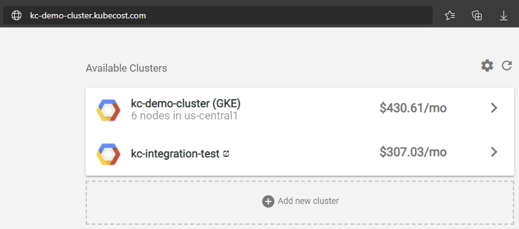
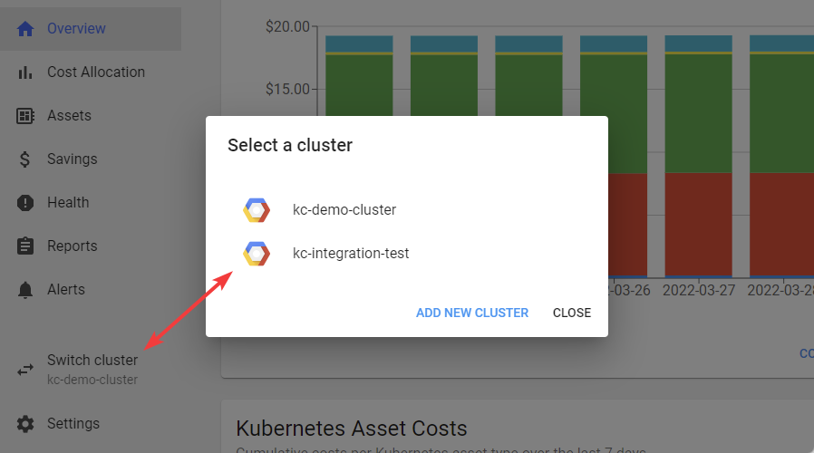

# Business Edition GCP

## Architecture

In Kubecost Business Edition, all clusters are configured identically. Each cluster has the ability to switch to other clusters via the Kubecost Homepage or via the Switch Cluster function in the UI.

*Kubecost Homepage*



*Switch Cluster*



>Note that the use of Thanos is not included in Business edition and all clusters wil have an independent Kubecost UI
## All Clusters Setup

```bash
kubectl create namespace kubecost
# Create secret for product key
# kubectl create secret generic productkey -n kubecost --from-file=productkey.json

# Create Cloud Integration Secret
kubectl create secret generic cloud-integration -n kubecost --from-file=cloud-integration.json

helm upgrade kubecost --repo https://kubecost.github.io/cost-analyzer/ cost-analyzer --install --namespace kubecost -f https://raw.githubusercontent.com/kubecost/cost-analyzer-helm-chart/develop/cost-analyzer/values.yaml -f ./values-google-primary.yaml
```

