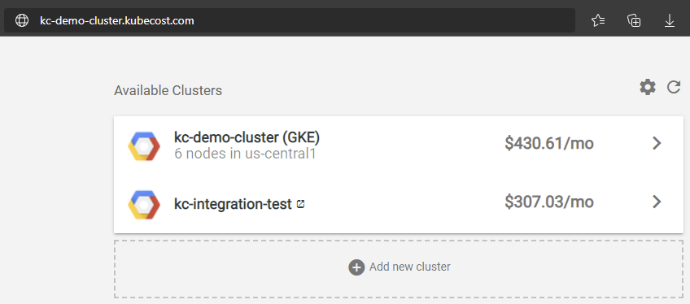
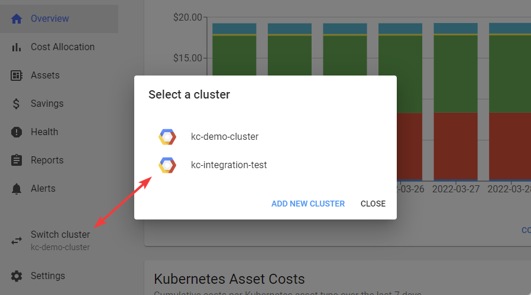

# Enterprise Edition GCP

## Architecture

In Kubecost Business Edition, all clusters are configured identically. Each cluster has the ability to switch to other clusters via the Kubecost Homepage or via the Switch Cluster function in the UI.

*Kubecost Homepage*



*Switch Cluster*



>Note that the use of Thanos is not included in Business edition and all clusters wil have an independent Kubecost UI

## Primary Cluster Setup

```bash
kubectl create namespace kubecost
# Create secret for product key
kubectl create secret generic productkey -n kubecost --from-file=productkey.json

# Create secret for Thanos store
kubectl create secret generic kubecost-thanos -n kubecost --from-file=object-store.yaml

# Create Cloud Integration Secret
kubectl create secret generic cloud-integration -n kubecost --from-file=cloud-integration.json

helm upgrade kubecost "kubecost/cost-analyzer" --install --namespace kubecost -f https://raw.githubusercontent.com/kubecost/cost-analyzer-helm-chart/develop/cost-analyzer/values.yaml -f https://raw.githubusercontent.com/kubecost/cost-analyzer-helm-chart/develop/cost-analyzer/values-thanos.yaml -f ./values-google-primary.yaml
```

## All Secondary Clusters Setup

>If your secondary clusters are in a different subscription, you may want to create a copy of this repository and modify the service-key.json per subscription.
>cloud-integration is not needed on secondary clusters

```bash
kubectl create namespace kubecost
# Create secret for product key
kubectl create secret generic productkey -n kubecost --from-file=productkey.json

# Create secret for Thanos store
kubectl create secret generic kubecost-thanos -n kubecost --from-file=object-store.yaml

helm upgrade kubecost "kubecost/cost-analyzer" --namespace kubecost --install -f https://raw.githubusercontent.com/kubecost/cost-analyzer-helm-chart/develop/cost-analyzer/values.yaml -f https://raw.githubusercontent.com/kubecost/cost-analyzer-helm-chart/develop/cost-analyzer/values-thanos.yaml -f ./values-google-secondary.yaml
```
