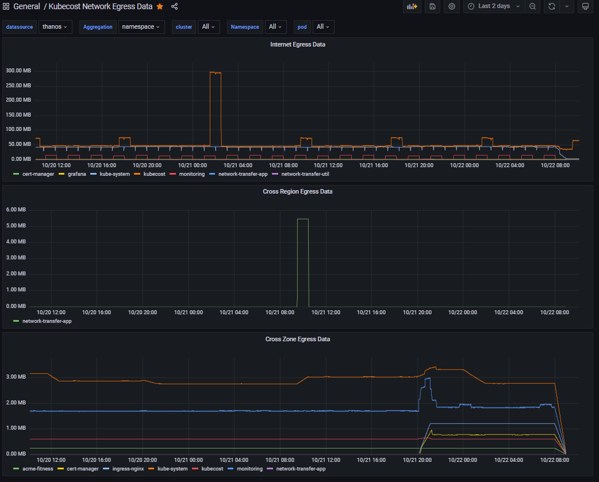

# Grafana Dashboards

If you do not use the Kubecost included prometheus, your `cluster_id` key may be simply `cluster` and `pod_name` may be `pod` etc.


## Network Transfer Dashboards

These dashboards rely on data scraped by the Kubecost Network Cost Daemonset.

Add a datasource to Grafana for thanos with your thanos frontend endpoint, the default is:
`http://kubecost-thanos-query-frontend-http:10902`

By default, the Grafana username and password is admin:strongpassword
This can be changed during kubecost deployment here:

```
--set grafana.adminPassword=yourpassword
```



## Network costs PromQL

### Internet
```
sum by(namespace)
 (increase(kubecost_pod_network_egress_bytes_total
 {
    cluster_id=~"$cluster",
    namespace=~"$Namespace",
    pod_name=~"$pod"
    internet="true",
 }
 [60m])) / 1024 / 1024
```

### Cross Region (must define region in network-cost configmap)
```
sum by(namespace)
 (increase(kubecost_pod_network_egress_bytes_total
 {
    cluster_id=~"$cluster",
    namespace=~"$Namespace",
    pod_name=~"$pod",
    internet="false",
    sameRegion="false",
    sameZone="false"
 }
 [60m])) / 1024 / 1024
```

### Cross Zone
```
sum by(namespace)
 (increase(kubecost_pod_network_egress_bytes_total
 {
    cluster_id=~"$cluster",
    namespace=~"$Namespace",
    pod_name=~"$pod",
    internet="false",
    sameRegion="true",
    sameZone="false"
 }
 [60m])) / 1024 / 1024
```
