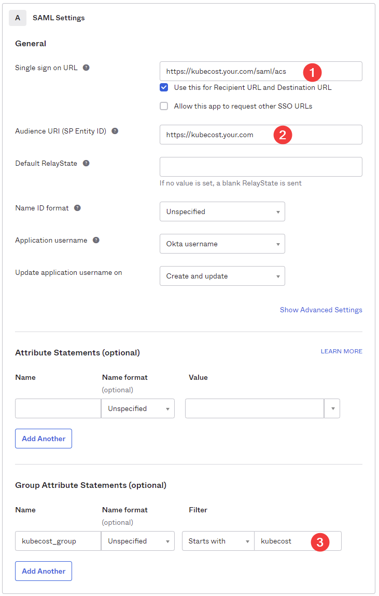
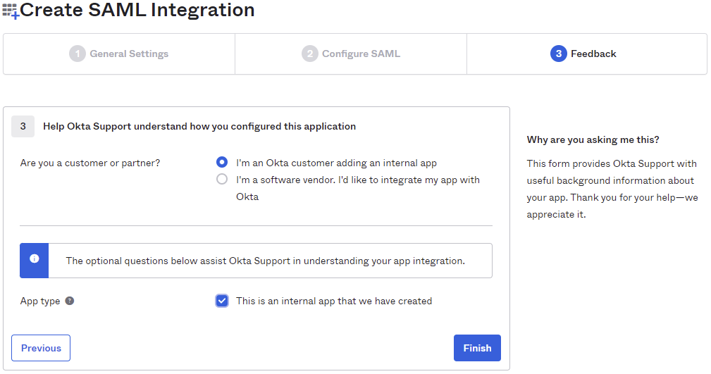
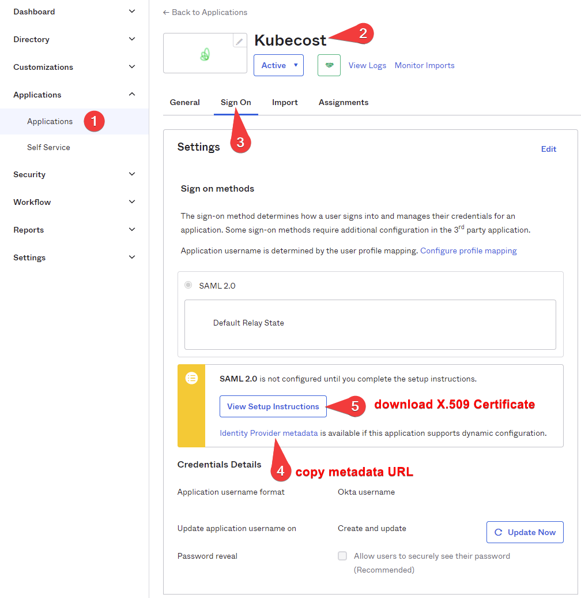

# Kubecost SSO and RBAC - Okta Integration

## Overview

Kubecost supports SAML 2.0 providers for:

1. Single sign on (SSO)
1. Role Based Access Control (RBAC): controlling read-only or admin access to Kubecost configuration within the UI (optional)
1. Filtering namespaces and clusters based on group membership (optional)

This guide uses Okta as an example, but the concepts apply to other providers as well.

## Requirements

Both SSO and RBAC require an Enterprise Subscription.

We recommend using our [helm chart](https://github.com/kubecost/cost-analyzer-helm-chart) to install Kubecost.

## Assistance and Feedback

We are looking for any feedback you may have on these functions and we are here to help!. Please don't hesitate to contact us via our [Slack community](https://join.slack.com/t/kubecost/shared_invite/enQtNTA2MjQ1NDUyODE5LWFjYzIzNWE4MDkzMmUyZGU4NjkwMzMyMjIyM2E0NGNmYjExZjBiNjk1YzY5ZDI0ZTNhZDg4NjlkMGRkYzFlZTU) - check out #support for any help you may need & drop your introduction in the #general channel.

## Okta Configuration

Create an application in Okta for Kubecost (SSO)

1. Go to the Okta admin dashboard (<your okta subdomain>.okta.com/admin/dashboard) and select `Applications>Create App Integration` and select `SAML 2.0`
1. On General Settings give the app a name. Feel free to use the [kubecost-logo.png](./images/kubecost-logo.png)
1. Your SSO URL should be your application root url followed by /saml/acs (https://kubecost.your.com/saml/acs)
1. Your Audience URI (SP Entity ID) should be set to your application root _without a trailing slash_ (https://kubecost.your.com)
1. (Optional) If you intend to use RBAC- on the Group Attribute Statements, enter a name (example `kubecost_group`) and a filter based on your group naming standards (example `Starts with` `kubecost_`)

    >Note: using a unique value (with "_") will assist with troubleshooting

    <details><summary>screenshot</summary>
    


    </details>

1. Press Next and on the Okta Feedback step, choose any appropriate values
   <details><summary>image</summary>


   </details>

1. On your Application Configuration Sign On page, copy the link for `Identity Provider metadata` and add that to the [values-saml.yaml](values-saml.yaml):idpMetadataURL
   <details><summary>screenshot</summary>


   </details>

1. On the same page, in the SAML 2.0 section: click `View Setup Instructions` and download the X.509 cert. Name it `myservice.cert`
1. Create a secret using the cert:

    ```bash
    kubectl create secret generic kubecost-okta --from-file myservice.cert --namespace kubecost
    ```
    >Note on configuring single app logout:
    ><BR>This can be configured in Okta following https://help.okta.com/en/prod/Content/Topics/Apps/Apps_Single_Logout.htm
    ><BR>Once done, update the [values.saml](values-saml.yaml):redirectURL value.
    ><BR>This will be in the `Identity Provider metadata` Look for `md:SingleLogoutService`
    ><BR>It will look like `https://dev-27772969.okta.com/app/dev-27772969_kubecost_1/exk4h09oysB785Han5d7/slo/saml`

1. With your existing helm install command, append "-f [values-saml.yaml](values-saml.yaml)" to the end.

    >At this point, we recommend testing to ensure SSO works before configuring RBAC below.
    ><BR>Note that there is a troubleshooting section at the end of this readme.

---
## RBAC: Admin/Read Only

The simplest form of RBAC in Kubecost is to have two groups: admin and read only.
>If your goal is to simply have 2 groups- admin and readonly, you do not need to configure filters.
><BR>If you do not configure filters, this message in the logs is expected: `file corruption: '%!s(MISSING)'`

The [values-saml.yaml](values-saml.yaml) file contains the `admin` and `readonly` groups in the RBAC section:

```yaml
  rbac:
    enabled: true
    groups:
      - name: admin
        enabled: true # if admin is disabled, all SAML users will be able to make configuration changes to the kubecost frontend
        assertionName: "kubecost_group" # a SAML Assertion, one of whose elements has a value that matches on of the values in assertionValues
        assertionValues:
          - "kubecost_admin"
          - "kubecost_superusers"
      - name: readonly
        enabled: true # if readonly is disabled, all users authorized on SAML will default to readonly
        assertionName:  "kubecost_group"
        assertionvalues:
          - "kubecost_users"
    customGroups: # not needed for simple admin/readonly RBAC
      - assertionName: "kubecost_group"
```

The `assertionName: "kubecost_group"` needs to match the name given in step 5 above.


---
## RBAC: Cluster/Namespace/Label/Annotation Filtering

Filters are used to give visibility to a subset of objects in Kubecost. Examples of the various filters available are in [filters.json](./filters.json).

These filters can be configured using groups or user attributes in your Okta directory. It is also possible to assign filters to specific users. The example below is using groups.

>Note that you can combine filtering with admin/readonly rights.

Filtering is configured very similarly to the `admin/readonly` above. The same group pattern match (`kubecost_group`) can be used for both, as is the case in this example.

Kubecost will use this section in the helm values file:

values-saml.yaml:
```yaml
    customGroups: # not needed for simple admin/readonly RBAC
      - assertionName: "kubecost_group"
```

The array of groups obtained during the auth request will be matched to the subject key in the filters.yaml:

filters.json
```json
{
   "kubecost_admin":{
      "allocationFilters":[
         {
            "namespace":"*",
            "cluster":"*"
         }
      ]
   },
   "kubecost_users":{
      "allocationFilters":[
         {
            "namespace":"",
            "cluster":"*"
         }
      ]
   },
   "kubecost_dev-namespaces":{
         "allocationFilters":[
            {
               "namespace":"dev-*,nginx-ingress",
               "cluster":"*"
            }
         ]
   }
}
```

As an example, we will configure the following:

- Admins will have full access to the Kubecost UI and have visibility to all resources
- Kubecost Users, by default, will not have visibility to any namespace and will be readonly. Note that if a group doesn't have access to any resources, the Kubecost UI may appear to be broken.
- The dev-namespaces group will have read only access to the Kubecost UI and only have visibility to namespaces that are prefixed with `dev-` or are exactly `nginx-ingress`


1. In the Okta Admin UI, navigate to `Directory>Groups>Add Group`
1. Create groups for kubecost_users, kubecost_admin and kubecost_dev-namespaces. Add all users to the kubecost_users group and the appropriate users to each of the other groups for testing.

    >Kubecost admins will be part of both the read only kubecost_users and kubecost_admin groups. Kubecost will assign the most rights (least restrictive) when there are conflicts. In the kubecost logs, you will see

1. In the kubecost_users group>Application tab, assign the Kubecost application. You do not need to assign the other `kubecost_` groups to the Kubecost application because all users already have access in the kubecost_users` group.
1. Modify [filters.json](./filters.json) as depicted above.
1. Create the configmap:

    ```bash
    kubectl create configmap group-filters --from-file filters.json -n kubecost
    ```

>Note that you can modify the configmap without restarting any pods.

    ```bash
    kubectl delete configmap -n kubecost group-filters && kubectl create configmap -n kubecost group-filters --from-file filters.json
    ```

## Troubleshooting / Logs

You can look at the logs on the cost-model container. In this example, the assumption is that the prefix for Kubecost groups is `kubecost_`. This is script is currently a work in progress.

```bash
kubectl logs deployment/kubecost-cost-analyzer -c cost-model --follow |grep -v -E 'resourceGroup|prometheus-server'|grep -i -E 'group|xmlname|saml|login|audience|kubecost_'
```

When the group has been matched, you will see:

```bash
auth.go:167] AUDIENCE: [readonly group:readonly@kubecost.com]
auth.go:167] AUDIENCE: [admin group:admin@kubecost.com]
```

```bash
configwatchers.go:69] ERROR UPDATING group-filters CONFIG: []map[string]string: ReadMapCB: expect }, but found l, error found in #10 byte of ...|el": "{ "label": "ap|..., bigger context ...|nFilters": [
         {
            "label": "{ "label": "app", "value": "nginx" }"
         }
     |...
```
---

### This is what normal looks like:


```bash
I0330 14:48:20.556725       1 costmodel.go:3421]   kubecost_user_type: {XMLName:{Space:urn:oasis:names:tc:SAML:2.0:assertion Local:Attribute} FriendlyName: Name:kubecost_user_type NameFormat:urn:oasis:names:tc:SAML:2.0:attrname-format:basic Values:[{XMLName:{Space:urn:oasis:names:tc:SAML:2.0:assertion Local:AttributeValue} Type: Value:}]}
I0330 14:48:20.556767       1 costmodel.go:3421]   firstname: {XMLName:{Space:urn:oasis:names:tc:SAML:2.0:assertion Local:Attribute} FriendlyName: Name:firstname NameFormat:urn:oasis:names:tc:SAML:2.0:attrname-format:basic Values:[{XMLName:{Space:urn:oasis:names:tc:SAML:2.0:assertion Local:AttributeValue} Type: Value:cost_admin}]}
I0330 14:48:20.556776       1 costmodel.go:3421]   kubecost_group: {XMLName:{Space:urn:oasis:names:tc:SAML:2.0:assertion Local:Attribute} FriendlyName: Name:kubecost_group NameFormat:urn:oasis:names:tc:SAML:2.0:attrname-format:basic Values:[{XMLName:{Space:urn:oasis:names:tc:SAML:2.0:assertion Local:AttributeValue} Type: Value:kubecost_admin}]}
I0330 14:48:20.556788       1 log.go:47] [Info] Adding authorizations '[admin group:admin@kubecost.com]' for user
I0330 14:48:20.556802       1 log.go:47] [Info] Token expiration set to 2022-03-31 14:48:20.556796875 +0000 UTC m=+86652.635776798
I0330 14:48:20.589730       1 log.go:47] [Info] Login called
I0330 14:48:20.619630       1 log.go:47] [Info] Attempting to authenticate saml...
I0330 14:48:20.619839       1 costmodel.go:813] Authenticated saml
I0330 14:48:20.702125       1 log.go:47] [Info] Attempting to authenticate saml...
I0330 14:48:20.702229       1 costmodel.go:813] Authenticated saml
...
I0330 14:48:21.011787       1 auth.go:167] AUDIENCE: [admin group:admin@kubecost.com]
```